## Introduction
El contexto de este apartado sería, tenemos ya una aplicación .net core que funciona tanto en local como en Azure y queremos containerizarla. Para ello:

## Steps to follow

1. Creamos un fichero Dockerfile que no tenga extensión. Tiene que estar en al raiz de nuestro proyecto.
   
2. Introducimos la primera línea de nuestro fichero
   
		FROM mcr.microsoft.com/dotnet/core/aspnet:2.2-nanoserver-1809 AS base
		WORKDIR /app
		EXPOSE 80

Aquí le estamos diciendo que nuestra aplicación corre robre un dotnet core 2.2 y para ello se tiene que descargar esa imagen del docker hub (por defecto si no hay un registry en local). Además le decimos que el directorio desde el que va a trabajar es el /app (del sistema de archivos del contenedor) y que el puerto sobre el que la aplicación se expone en el 80
	
3. Ahora que tenemos el fichero con la primera parte, vamos a generar la primera versión de nuestra imagen a partir de este fichero.

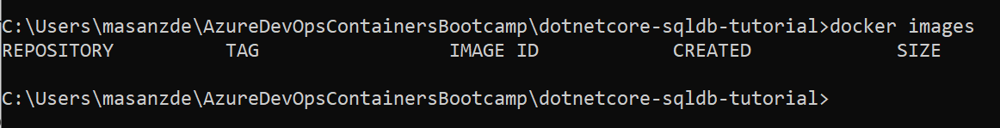	
	
		docker build -t myimage:initial -f Dockerfile .
Aquí le decimos que construya la imagen myimage y que lo haga a partir del Dockerfile que está en el mismo directorio en el que estamos.

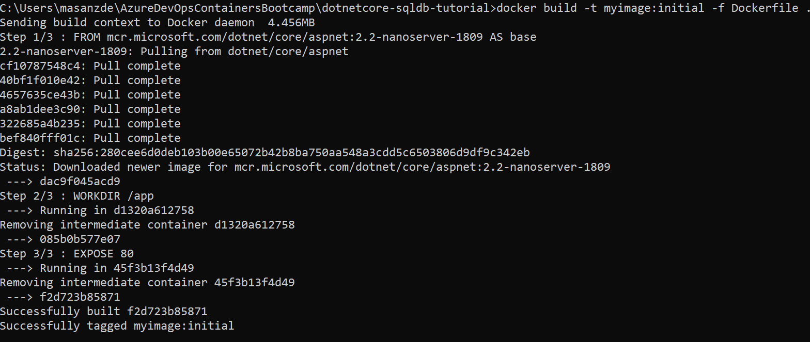	
	
Si nos fijamos veremos que lo ha creado con el tagg initial porque, cuando hemos metido el comando. Todo debería tener control de versiones a través del tag. Por defecto, si no se dice nada el tag es **latest**.
	
4. Comprobamos que efectivamente tenemos esa imagen con el comando:
   
		docker images

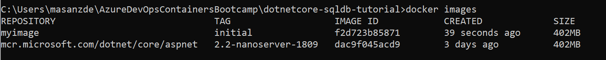	

5. Lo que podemos ver es que tenemos dos imágenes creadas, una es la imagen de base que ha sacado directamente del hub (porque no hay un regitry creado localmente y por defecto va al hub) y la otra es la que nos ha creado a partir del hub. En caso de que la única línea que hubiesemos puesto en el fichero hubiese sido la primera, indicando cuál es la imagen base, el id de las imágenes sería el mismo porque serían dos copias exactas. Como hemos cambiado algunos parámetros como el puerto en el que expondremos esta imagen y del directorio donde vamos a trabajar el id cambia porque la imagen es ligeramente distinta. 
	
Si hacemos un docker image inspect myimage:initial podemos ver los datos de la imagen que acabamos de generar con las capas. 
	
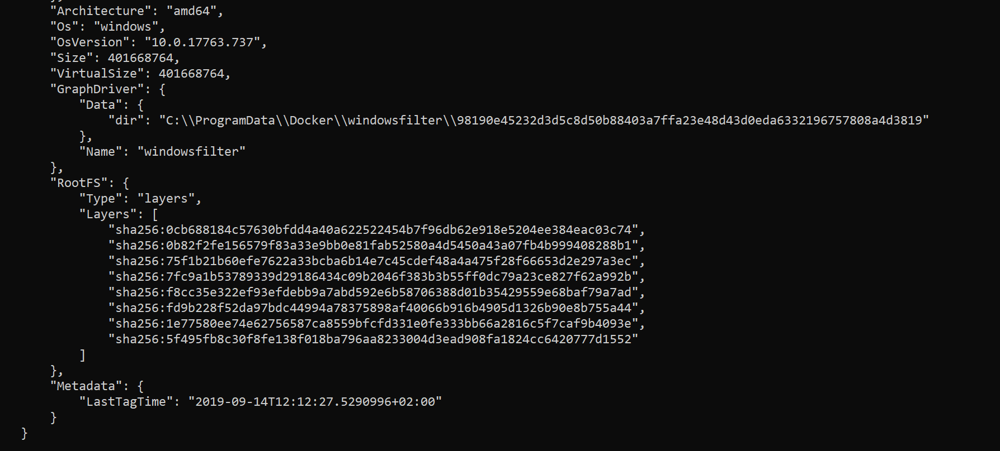		

En este caso tenemos ocho layers que definen los cambios que se han configurado en nuestra imagen.
	
6. Añadimos más configuraciones al docker file. El siguiente grupo define que tiene que utilizar el sdk que ya va incluido en la imagen que se ha descargado anteriormente, que tiene que copiar el proyecto al direcotrio de trabajo del contenedor (/src) y le pide que corra un restore y un build de la aplicación.
	
		FROM mcr.microsoft.com/dotnet/core/sdk:2.2-nanoserver-1809 AS build
		WORKDIR /src
		COPY ["DotNetCoreSqlDb.csproj", ""]
		RUN dotnet restore "./DotNetCoreSqlDb.csproj"
		COPY . .
		WORKDIR "/src/."
		RUN dotnet build "DotNetCoreSqlDb.csproj" -c Release -o /app
		
Volvemos a crear la imagen pero con un tag nuevo, en este caso será build.

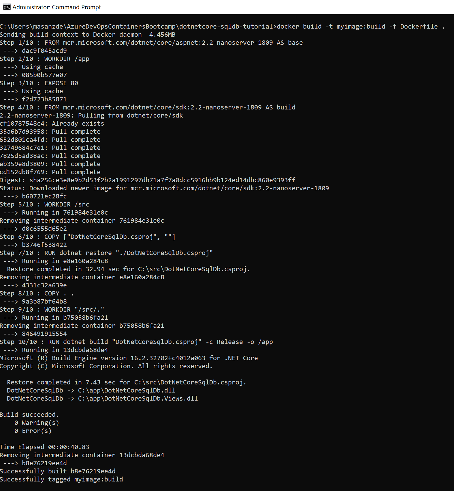	

Comprobamos ahora las layers

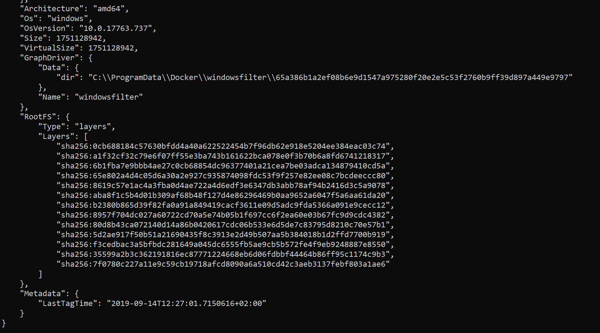		
	
Estas nuevas layers que se han formado representan los cambios que hemos aplicado a la imagen del contenedor
	
7. El siguiente bloque es que el hace el publish de nuestra aplicación. Para ello toma como base la imagen que a nombrado build en el bloque anterior y guarda esta nueva modificación como publish.
	
		FROM build AS publish
		RUN dotnet publish "DotNetCoreSqlDb.csproj" -c Release -o /app

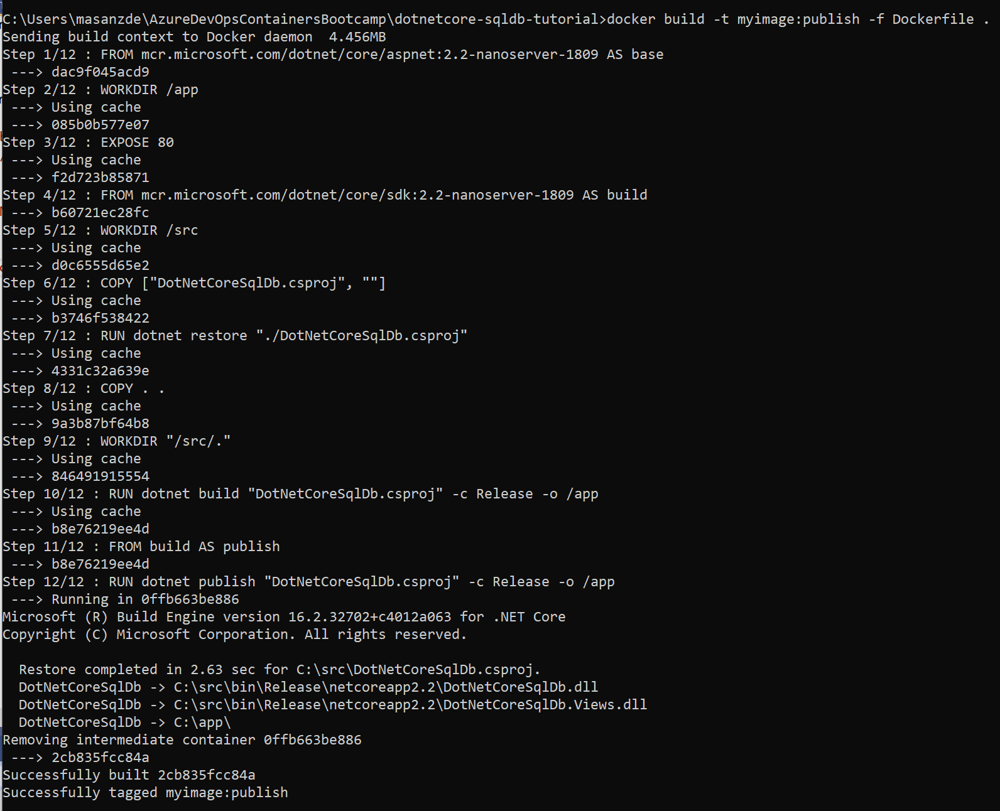			
				
8. El último bloque copia todo lo que se publicado en el directorio /app del contenedor y expone ese contenido como un ejecutable utilizando para ello un ENTRYPOINT. Mientras ese entrypoint este activo podremos ejecutar la aplicación dentro del contenedor. En el momento en el que lo paremos la aplicación deja de estar disponible 
	
		FROM base AS final
		WORKDIR /app
		COPY --from=publish /app .
		ENTRYPOINT ["dotnet", "DotNetCoreSqlDb.dll"]
		
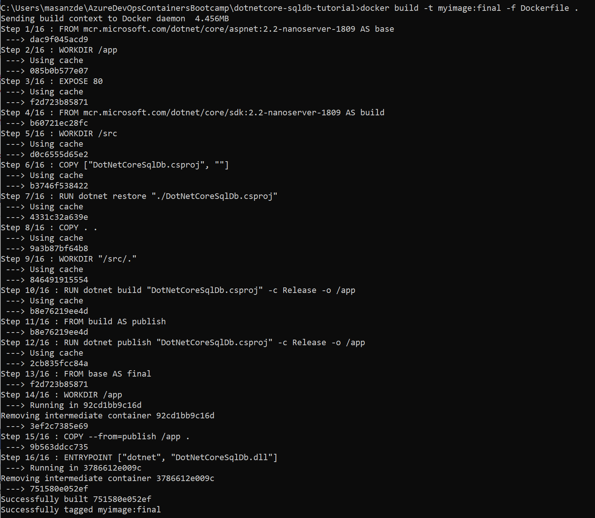			

9. Veamos todas las imágenes versionadas que hemos ido generando:
	
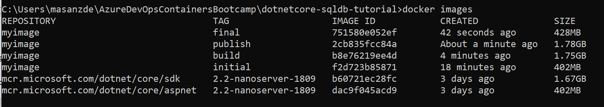		
		
10. Ejecutamos el contenedor
	
	Docker run --name myapp -p 82:80 -d myimage:final

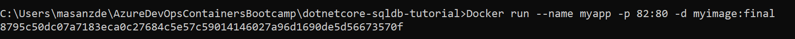		

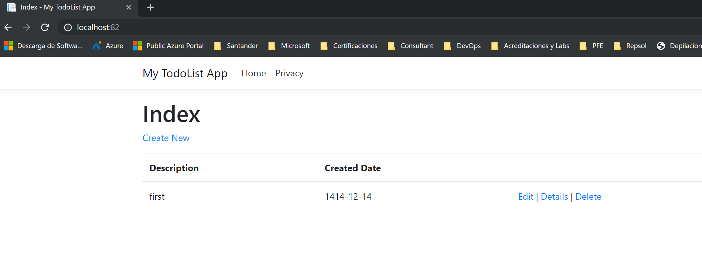		
	

11. Por defecto, tal y como tenemos el proyecto descargado de git el código va a tirar de la base de datos que tiene en local para mostrar la información. Podemos decidir de qué datos tira utilizando los ficheros Startup.cs y appsetings.json

En el Starup.cs

            if (Environment.GetEnvironmentVariable("ASPNETCORE_ENVIRONMENT") == "Production")
                services.AddDbContext<MyDatabaseContext>(options =>
                        options.UseSqlServer(Configuration.GetConnectionString("MyDbConnection")));
            else
                services.AddDbContext<MyDatabaseContext>(options =>
                        options.UseSqlite("Data Source=localdatabase.db"));

En el appsettings.json
	
	"ConnectionStrings": {
	    "MyDbConnection": "Server=tcp:masanzdesqlsrvdev01.database.windows.net,1433;Initial Catalog=coreDB;Persist Security Info=False;User ID=bootcampdev;Password=Microsoft$20;MultipleActiveResultSets=False;Encrypt=True;TrustServerCertificate=False;Connection Timeout=30;"
	  }
	
Tendríamos que comentar y descomentar este código en función de lo que queramos que muestre y así podríamos ver los datos que tenemos que tenemos guardados en local/nube.

		
		
		
		
		
